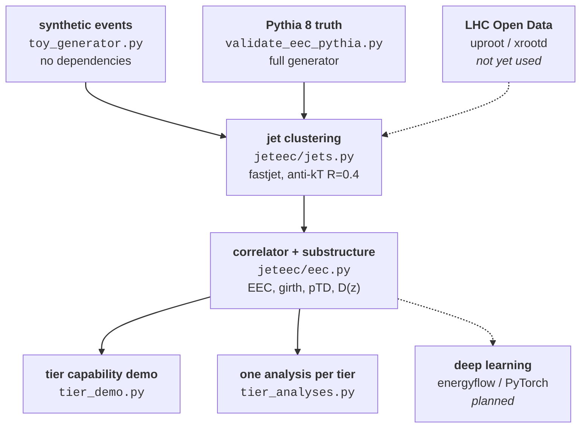

# Jet substructure with energy-energy correlators

A jet is the spray of hadrons left behind when a quark or gluon is knocked out of a
collision. Its *internal* structure carries the history of that parton's decay
cascade -- and the **energy-energy correlator (EEC)** is the cleanest way to read
that history out: it measures how much energy sits at each angular separation
inside the jet. Large angles are the perturbative parton shower; small angles are
where the shower ends and hadrons form. The transition between them is a direct
look at where QCD stops being calculable.

This repository builds that measurement end to end -- jet clustering, EEC,
substructure observables, and the deep-learning component -- on LHC open data, and
validates each step on synthetic events first.

<p align="center">
  
</p>

> **Status: the pipeline is built and validated on synthetic events; no open data
> has been analysed yet.** Every number below comes from `src/toy_generator.py`,
> which has no matrix element, no parton shower and no hadronisation. It is a
> pipeline test, not a measurement. What it *does* establish is that the
> clustering, the correlator and its normalisation are correct before any real
> data is touched.

---

## What runs today

One command, fixed seed, no external data:

```bash
python src/tier_analyses.py --n-events 2000 --seed 12345
```

| Tier | What it permits | Headline number |
|---|---|---|
| NanoAOD -- jet four-vectors only | inclusive spectrum, dijet $\chi$, $R_{32}$ | spectrum index $n = 4.85$ (generated 5.0) |
| PFNano -- + in-jet constituents | $D(z)$, multiplicity, girth, $p_TD$, **EEC** | EEC normalisation $= 1.000000$ |
| MiniAOD -- + all candidates | radius scan, trimming, charged-only | trimming removes $18.8\%$ of jet mass |
| AOD -- + pre-reconstruction access | tracking systematics | EEC shifts $\lesssim 2\%$ |

These are reproducible: re-running the command above regenerates every figure and
every number in [`docs/tier_analyses_results.md`](docs/tier_analyses_results.md)
bit for bit. If a number moves, something broke.

---

## Quick start

```bash
# environment (Miniforge/mamba)
mamba env create -f environment.yml
conda activate jet-eec

# 1. is the pipeline correct?  -- run this FIRST, before any open data
python src/validate_eec_pythia.py --n-events 2000 --seed 12345

# 2. which data tier do I actually need?
python src/tier_demo.py --n-events 400 --seed 12345

# 3. one real analysis per tier
python src/tier_analyses.py --n-events 2000 --seed 12345
```

Step 1 generates Pythia dijets, clusters anti-$k_T$ $R = 0.4$ jets, and checks that
the EEC weights sum to 1 per jet. **It must pass before open data is touched** -- a
failure there is a pipeline bug, far cheaper to find on truth particles than on
detector data. Steps 2 and 3 need no Pythia; `src/toy_generator.py` stands in.

Docker instead of conda:

```bash
docker build -t jet-eec .
docker run -it --rm -p 8888:8888 -v "$PWD":/work jet-eec   # http://localhost:8888
```

Working conventions -- commit rules, what goes to Notion versus GitHub, the
reasoning behind past decisions -- are in [`docs/WORKFLOW.md`](docs/WORKFLOW.md).

---

## How it fits together



Dashed edges are not built yet. The point of the layout is that **the event source
is interchangeable**: toy, Pythia truth and real constituents all enter the same
clustering call, so the pipeline can be validated where the answer is known and
then pointed at data without changing the analysis code.

---

<details>
<summary><b>0. Theory background: what an EEC measures</b></summary>

### 0.1 Definition

Take a jet, take every pair of constituents $(i,j)$ inside it, and histogram their
angular separation weighted by the product of their transverse momenta:

$$\mathrm{EEC}(R_L) = \sum_{i,j} \frac{p_{T,i}\,p_{T,j}}{p_{T,\mathrm{jet}}^2}\,\delta(R_L - \Delta R_{ij}), \qquad \Delta R_{ij} = \sqrt{\Delta\eta_{ij}^2 + \Delta\phi_{ij}^2}$$

It is an *energy-weighted* angular distribution, not a particle count. That is the
whole reason it is useful: energy weighting makes the observable insensitive to
exactly the soft, non-perturbative junk that particle counting is most sensitive
to, so the same quantity can be computed in perturbation theory and measured in a
detector.

### 0.2 Why the normalisation is a unit test

Summing over **all ordered pairs including $i = j$**, and taking
$p_{T,\mathrm{jet}}$ to be the scalar sum $\sum_k p_{T,k}$ of constituent momenta,

$$\sum_{i,j} \frac{p_{T,i}\,p_{T,j}}{\left(\sum_k p_{T,k}\right)^2} = \frac{\left(\sum_i p_{T,i}\right)\left(\sum_j p_{T,j}\right)}{\left(\sum_k p_{T,k}\right)^2} = 1$$

exactly, with no physics input at all. So `normalisation_check()` returning
anything other than $1.000000$ means the constituent collection is wrong, or a
weight is being double-counted, or the normalisation uses the clustered jet $p_T$
instead of the scalar sum -- **before** any physics claim is made. That is why
step 1 of the Quick start exists, and why the number is printed on every run.

Self-pairs sit at $\Delta R = 0$ and fall outside log-spaced bins, so they are
dropped harmlessly by the histogram while still making the sum exact.

### 0.3 What the angular scales mean

Reading the EEC from right to left:

- **Large $R_L$** ($\sim R$, the jet radius): the perturbative regime. The
  distribution follows a power law set by the QCD splitting functions, and its
  slope is sensitive to $\alpha_s$.
- **A turnover at small $R_L$**: the shower has run out of phase space and
  hadronisation takes over. The position of that turnover is set by
  $\Lambda_{\mathrm{QCD}}/p_T$ -- so it *moves* with jet $p_T$, which is what makes
  it a measurement of a confinement scale rather than a detector artefact.
- **Very small $R_L$**: free hadrons, and, in practice, the detector's angular
  resolution.

This is also why the data tier matters so much here (section 1): the interesting
physics sits at small angles, exactly where angular granularity runs out.

### 0.4 What else the constituents buy

The same constituent list gives the classical substructure observables for free,
and they are computed alongside the EEC as cross-checks:

| Observable | Definition | Reads |
|---|---|---|
| $D(z)$ | $z = p_{T,\mathrm{const}}/p_{T,\mathrm{jet}}$ | fragmentation: jets are mostly soft particles |
| multiplicity | $n_{\mathrm{const}}$ | grows logarithmically with jet $p_T$ (soft-gluon emission) |
| girth | $\sum_i z_i \Delta R_i$ | jet width; larger for gluon jets |
| $p_TD$ | $\sqrt{\sum_i p_{T,i}^2}\,/\sum_i p_{T,i}$ | momentum sharing; smaller for gluon jets |

Convention note: papers differ on EEC normalisation and pair counting. The choices
made here are stated explicitly at the top of `src/jeteec/eec.py` -- worth reading
before comparing any number against the literature.

Reference: Larkoski, Moult, Neill, *Energy correlation functions for jet
substructure*, JHEP 06 (2013) 108, [arXiv:1305.0007](https://arxiv.org/abs/1305.0007).

</details>

<details>
<summary><b>1. Data tiers: why this project cares</b></summary>

EEC needs the particles *inside* each jet. Most reduced data formats do not store
them, so the tier choice is not a storage convenience here -- it decides whether
the measurement is possible at all.

| Tier | Stores | EEC? |
|---|---|---|
| NanoAOD | jet four-vectors | no -- no constituents |
| PFNano | + particles inside each jet | **yes**, but the radius is frozen at $R = 0.4$ |
| MiniAOD | + every packed candidate in the event | yes, plus free choice of $R$ and grooming |
| AOD | + pre-reconstruction access | yes, plus tracking systematics |
| RECO | hits and clusters | not open data; detector physics, not jet physics |

Two quantitative results from `tier_analyses.py` make the choice concrete rather
than a matter of taste:

- **MiniAOD's angular packing puts a floor under the EEC.** Below
  $R_L = 5\times10^{-3}$, 4 of 12 bins are empty in the packed sample and 0 in the
  unpacked one -- and that is precisely the region where the hadronisation
  turnover lives.
- **A wider jet sweeps in more of the event.** $\langle p_T\rangle$ rises by
  $2.48$ GeV going from $R = 0.4$ to $R = 1.0$, which is impossible to see at
  PFNano because it only ever stored what was already inside $R = 0.4$.

Mechanics in [`docs/data_tiers.md`](docs/data_tiers.md); what each tier lets you
*measure* and in what order to attack them in
[`docs/tier_physics_programme.md`](docs/tier_physics_programme.md); the full
per-tier results in [`docs/tier_analyses_results.md`](docs/tier_analyses_results.md).

</details>

<details>
<summary><b>2. Environment</b></summary>

Two layers, complementary rather than competing:

```
Layer 1 - DATA ACCESS (Docker)      experiment image -> download / skim Open Data
                                    needed ONLY for CMS AOD (CMSSW); flat ntuples skip it
                                    output: flat ROOT / parquet with 4-vectors
                     |
                     v  flat ntuples (constituents)
Layer 2 - ANALYSIS + ML (conda)     uproot -> awkward -> fastjet -> EEC -> hist -> plot
                                    PyTorch; experiment-agnostic
```

The same `environment.yml` and `Dockerfile` cover all four LHC experiments; only
the Layer 1 fetch differs.

**System level, installed once:** Miniforge/Mambaforge, git, Docker, and
`nvidia-container-toolkit` if you want the GPU.

**Inside the `jet-eec` env** (`environment.yml`): `numpy` `scipy` `pandas`
`matplotlib` `numba` for the $O(N^2)$ pair loop / `uproot` `awkward` `vector` for
ROOT without ROOT / `fastjet` (scikit-hep) for clustering / `hist`
`boost-histogram` `mplhep` for plots / `particle` `hepunits` / `coffea` to scale
across files / `xrootd` to stream open data / `energyflow` for EFPs and
EFN/PFN networks / `pytorch` `scikit-learn` / `pythia8` / `jupyterlab`.
Optional: `root` from conda-forge if you want PyROOT.

```bash
mamba env create -f environment.yml && conda activate jet-eec
python -c "import uproot, awkward, vector, fastjet, energyflow, torch; print('ok')"
conda env export --no-builds > environment.lock.yml   # commit this
```

GPU PyTorch: `mamba install -n jet-eec pytorch pytorch-cuda=12.4 -c pytorch -c nvidia`.

</details>

<details>
<summary><b>3. Data access: what actually exists</b></summary>

| Source | Open? | Notes |
|---|---|---|
| CMS | yes | largest release. NanoAOD (light, uproot-readable) to AOD (needs CMSSW in Docker) |
| ATLAS | yes | 13 TeV flat ntuples, lightest start; official Jupyter Docker image |
| ALICE | yes | on the CERN Open Data portal |
| LHCb | yes | on the portal, more limited but growing |
| RHIC (STAR / sPHENIX) | no | collaboration access only. sPHENIX is jet-focused and ideal for EEC, but not downloadable |
| Tevatron (CDF / D0) | no | preserved (~9 PB each on CVMFS) for the collaborations, not open |

**Practical path:** start with ATLAS 13 TeV ntuples or CMS NanoAOD (no framework
needed), and reserve CMSSW-in-Docker for CMS AOD only if the analysis requires it.

The catch is constituents again: plain NanoAOD stores jets but not always all of
their particles. Use PFNano-style releases or AOD (CMS), or track/topocluster
collections (ATLAS). Develop on Pythia first, then map onto the richest tier
available.

</details>

---

## Known trap: fastjet silently returns wrong jets

Passing an awkward record with **extra fields** (here `charge`) to
`fastjet.ClusterSequence` produces wrong jets with no error and no warning. Measured
on this sample, the subjet four-vector sum missed the parent jet by up to
**168 GeV in $p_T$ and 502 GeV in mass**.

It is data dependent: the first clustering pass looked fine and only the
reclustering step exposed it.

**Always strip to `pt, eta, phi, mass` before calling fastjet** -- `jeteec.jets.four`
does this -- and re-associate charge or PID afterwards by $\Delta R$ matching
(`constituents_by_dr`).

---

## Repository layout

```
environment.yml, Dockerfile     env definition and reproducible container
src/jeteec/jets.py              clustering wrapper (fastjet, awkward)
src/jeteec/eec.py               EEC + normalisation check
src/jeteec/plot.py              mplhep styling
src/validate_eec_pythia.py      run FIRST: validates the pipeline on truth
src/toy_generator.py            dependency-free stand-in for Pythia
src/tier_demo.py                what each data tier can and cannot do
src/tier_analyses.py            one real analysis per tier
notebooks/                      exploration (strip outputs before committing)
data/raw|interim|processed/     not committed; see data/README.md
results/figures|tables/          outputs; the tier_*.png are committed for the docs
models/                         checkpoints, gitignored
docs/                           notes mirrored to Notion
```

## Reproducibility rules

- Commit `environment.lock.yml` (exact versions), not just `environment.yml`.
- Record the **dataset DOI / record ID** for every open-data sample used.
- Set and log random seeds (`numpy`, `torch`) in every run; the analyses above are
  seeded so their numbers are checkable.
- Keep the failure log. Mismatched constituent collections and jet-area / pileup
  subtraction are the usual early pitfalls -- as is the fastjet trap above.

## Sources

- [CMS Open Data -- Docker guide](https://cms-opendata-guide.web.cern.ch/tools/docker/) / [Running CMS analysis with Docker](https://opendata.cern.ch/docs/cms-guide-docker)
- [ATLAS Open Data -- notebooks](https://opendata.atlas.cern/docs/notebooks/intro) / [notebooks Docker image](https://github.com/atlas-outreach-data-tools/notebooks-collection-opendata)
- [scikit-hep/fastjet](https://github.com/scikit-hep/fastjet) / [fastjet awkward interface](https://fastjet.readthedocs.io/en/latest/Awkward.html)
- [Data preservation at the Fermilab Tevatron](https://arxiv.org/abs/1701.07773)
