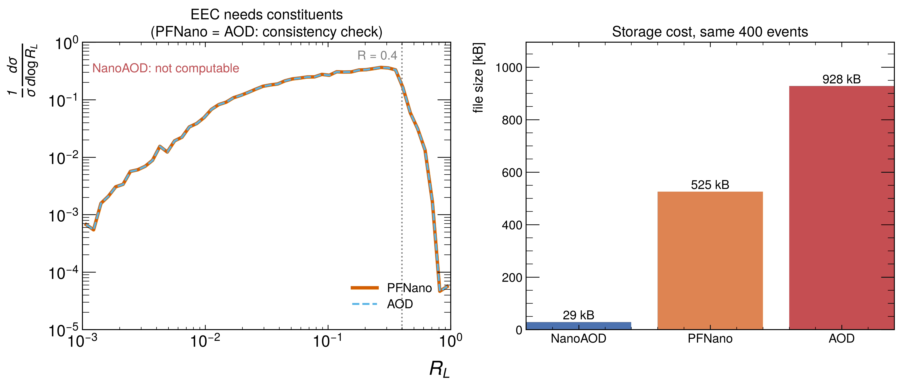

# Data tiers — what each one lets you do

A **data tier** is a stage in the chain from detector signals to analysis-ready objects. Each
step throws information away to save space. The question that matters for this project is
always the same: **does the tier still store the individual particles inside a jet?**

Run the demo yourself:

```bash
python src/tier_demo.py --n-events 400 --seed 12345
```

It generates one sample, writes it out at three tiers with realistic branch structure, then
tries five analyses on each and reports what survives.

---

## The tiers (CMS naming)

| Tier | What it keeps | Size / event | How you read it |
|---|---|---|---|
| **RAW** | detector signals | ~1 MB | collaboration only |
| **RECO** | full reconstruction, all hits & track detail | ~3 MB | effectively unused |
| **AOD** | physics objects **+ all PFCandidates** | ~200 kB | CMSSW (Docker image) |
| **MiniAOD** | AOD slimmed; PFCandidates partly kept | ~40 kB | CMSSW |
| **NanoAOD** | flat ROOT ntuple, jet kinematics | ~1–2 kB | **uproot, directly** |
| **PFNano / JMENano** | NanoAOD **+ in-jet PFCandidates** | ~10–20 kB | **uproot, directly** |

ATLAS/ALICE/LHCb use different names (ATLAS: RAW → ESD → AOD → DAOD; ALICE: ESD → AOD →
derived) but the same idea applies — the question is still whether constituents survive.

Note that "AOD" means **different things** in CMS and ATLAS. In CMS, AOD is a rich tier with
PFCandidates. In ATLAS, AOD is followed by DAOD (derived AOD), and the Open Data release is a
flat ntuple further downstream. Always check the actual branch list rather than trusting the
tier name.

---

## Demo results

Same 400 events, written at three tiers:

```
                            NanoAOD     PFNano      AOD
  Jet pT spectrum           YES         YES         YES
  Dijet mass                YES         YES         YES
  Constituent multiplicity  NO          YES         YES
  EEC                       NO          YES         YES
  Recluster at R=0.8        NO          NO          YES

  file size                 29 kB       525 kB      928 kB
```



### Reading the three rows that differ

**Constituent multiplicity / EEC — NanoAOD fails.** The branch list is the whole story:

```
NanoAOD   Jet_eta, Jet_mass, Jet_phi, Jet_pt
PFNano    Jet_*, PFCand_eta, PFCand_jetIdx, PFCand_mass, PFCand_phi, PFCand_pt
AOD       PFCand_eta, PFCand_mass, PFCand_phi, PFCand_pt
```

The EEC sums over pairs of particles *inside* a jet:

$$\text{EEC}(R_L) = \sum_{i,j} \frac{p_{T,i}\,p_{T,j}}{p_{T,\text{jet}}^2}\,\delta(R_L - \Delta R_{ij})$$

With only `Jet_pt/eta/phi/mass` there are no $i,j$ to sum over. No amount of cleverness
recovers them — the information is not in the file.

**Recluster at R=0.8 — PFNano fails too.** PFNano stores only the particles that *ended up
inside* an R=0.4 jet. A wider R=0.8 cone would sweep in particles between and around those
jets, and those were dropped. So PFNano freezes your jet definition: you inherit whatever R
and algorithm the central production used. Only AOD keeps the whole event, which is why it is
the only tier where jet definition is still yours to choose.

In the demo, reclustering at R=0.8 raises $\langle p_T \rangle$ from 217.5 to 219.2 GeV — the
wider cone captures soft radiation that R=0.4 missed. Small here because the toy sample has a
mild underlying event; in real heavy-ion data this difference is large.

**AOD reproduces PFNano exactly.** Both give `norm = 1.0000`, `<n> = 29.0`, and identical EEC
curves (the two lines in the figure lie on top of each other). That is the demo's internal
consistency check: same events, same answer, different starting information.

### Note on the AOD file in the demo

It stores *no jets at all* — only particles. That is deliberate and faithful: at AOD level you
run the clustering yourself. Storing jets there would hide the very freedom that defines the
tier.

---

## What this means for the project

1. **NanoAOD is out** for EEC. Fine for jet spectra, dijet mass, event selection, and
   FatJet summary substructure — nothing involving constituents.
2. **PFNano is the sweet spot to *work in*.** Constituents present, uproot-readable, ~20×
   smaller than AOD. Accept the fixed jet radius.
   ⚠️ **But PFNano is not a released Open Data format** — it is a CMSSW framework you run
   yourself over MiniAOD to produce those files. Budget one CMSSW Docker pass to get there.
3. **AOD only if** you need a non-standard R, a different algorithm, custom grooming, or
   track-level detail that MiniAOD's compressed candidates drop.

See [`tier_physics_programme.md`](tier_physics_programme.md) for what each tier actually lets
you measure, and the recommended order of attack.

The demo's cost ratio (29 : 525 : 928 kB) understates the real gap — real NanoAOD is ~1–2 kB
per event against ~200 kB for AOD, roughly two orders of magnitude. On a dataset of millions
of events, that is the difference between a laptop and a grid allocation.

---

## Checking a real Open Data file before committing to it

Once you download a candidate sample, this tells you in seconds whether it can do EEC:

```python
import uproot
f = uproot.open("your_file.root")
tree = f["Events"]
print([k for k in tree.keys() if "PFCand" in k or "Constituent" in k])
```

Empty list → jet kinematics only → no EEC. Look for `PFCands_*`, `FatJetPFCands`,
`JetPFCands`, or an equivalent per-experiment collection with an index branch (`jetIdx`)
linking candidates back to jets.

---

## Sources

- [CMS Open Data — Docker guide](https://cms-opendata-guide.web.cern.ch/tools/docker/)
- [CMS Open Data — analysis with Docker](https://opendata.cern.ch/docs/cms-guide-docker)
- [ATLAS Open Data — notebooks](https://opendata.atlas.cern/docs/notebooks/intro)
- [scikit-hep/fastjet](https://github.com/scikit-hep/fastjet)
- Larkoski, Moult, Neill, *Energy correlation functions for jet substructure*, JHEP 06 (2013) 108, [arXiv:1305.0007](https://arxiv.org/abs/1305.0007)
