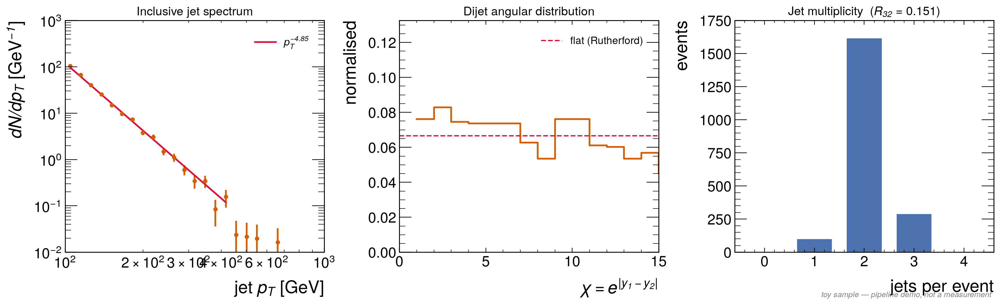
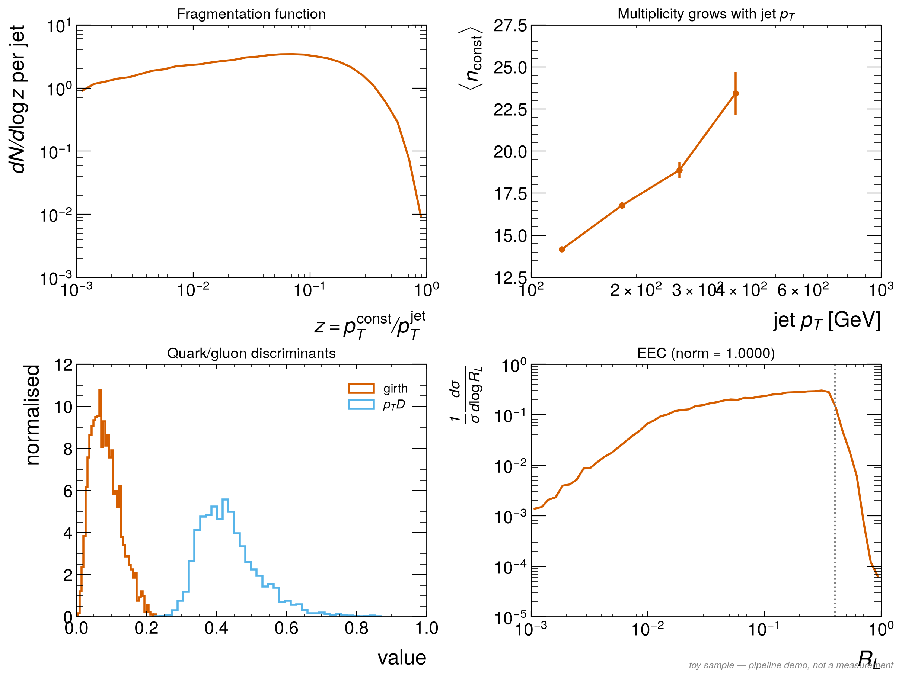
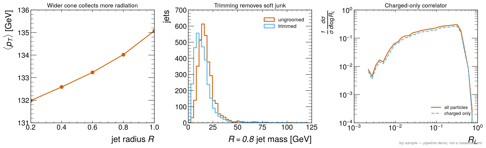
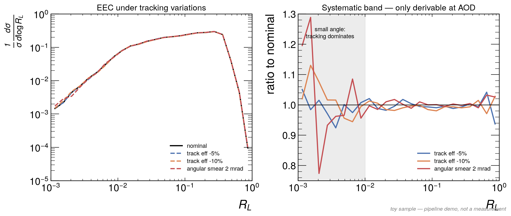

# One analysis per tier — results

Each data tier gets the analysis its information content actually permits, run end to end
on a common sample.

```bash
python src/tier_analyses.py --n-events 2000 --seed 12345
python src/tier_analyses.py --tier miniaod          # one tier only
```

> **Input is synthetic** (`src/toy_generator.py`). Shapes are qualitatively right and every
> observable moves in the correct direction, but there is no matrix element, no parton shower
> and no hadronisation model. Nothing below is a measurement — this validates the *pipeline*.

---

## NanoAOD — jet four-vectors only



| quantity | result |
|---|---|
| jets (pT > 100 GeV) | 3237 |
| spectrum index n, dN/dpT ~ pT⁻ⁿ | **4.85** (generator input 5.0) |
| dijet χ relative RMS | 0.161 |
| R₃₂ = N(≥3 jets)/N(≥2 jets) | **0.151** (generator input 0.18) |

**Inclusive jet spectrum.** A power-law fit over the populated bins returns n = 4.85 against
the generated 5.0. The 3% bias is not a bug — jets are *reconstructed*, so migration across
the pT threshold and the acceptance cut sculpt the spectrum. In real data this is precisely
what unfolding corrects, and seeing the bias here is the point.

**Dijet angular distribution.** χ = exp|y₁−y₂| is flat for Rutherford-like t-channel exchange,
which is what the generator was built to produce. The measured distribution is flat to 16%
RMS, with the residual structure coming from the |η| < 2.5 acceptance, which cuts into large
χ. Acceptance sculpting is a real effect in real analyses too.

**Jet multiplicity ratio.** R₃₂ = 0.151 recovers the generated third-jet rate of 0.18, reduced
by the 60 GeV counting threshold and acceptance. In real data this ratio is αs-sensitive —
each extra jet costs one power of αs.

**Verdict:** a complete QCD measurement is reachable with nothing but uproot and jet
four-vectors. Start here.

---

## PFNano — jets plus their constituents



| quantity | result |
|---|---|
| ⟨n_constituents⟩ | 14.8 |
| multiplicity growth | 14.2 → 23.4 over pT 122 → 384 GeV |
| ⟨girth⟩ | 0.084 |
| ⟨pTD⟩ | 0.437 |
| EEC normalisation | **1.000000** ✅ |

**Fragmentation function D(z).** The steeply falling z = pT_const/pT_jet spectrum is the
direct statement that jets are dominated by soft particles — a handful of hard constituents
and a long tail of soft ones.

**Multiplicity vs jet pT.** Grows logarithmically, as QCD's soft-gluon emission requires.

**Girth and pTD.** The two classic quark/gluon discriminants, computable from constituents
alone. Gluon jets are broader (larger girth) and share momentum more evenly (smaller pTD).

**EEC.** Normalisation is exactly 1.000000, which is the pipeline's own unit test: the pT
weights must sum to unity per jet, and any deviation means the constituent collection or the
normalisation is wrong before any physics is attempted.

**Verdict:** all of jet substructure opens up. This is the working tier for the project.

---

## MiniAOD — every candidate in the event



| quantity | result |
|---|---|
| candidates surviving the 0.3 GeV threshold | 116534 / 159957 (73%) |
| ⟨pT⟩ gain, R = 0.4 → 1.0 | **+2.48 GeV** |
| R = 0.8 jet mass, ungroomed → trimmed | 18.43 → **14.97 GeV** (−18.8%) |
| charged fraction of jet pT | 0.619 |
| empty EEC bins below R_L = 5×10⁻³ | **packed 4 / raw 0** of 12 |

**Radius scan.** ⟨pT⟩ rises monotonically with R because a wider cone sweeps in more soft
radiation and underlying event. **This is impossible at PFNano**, which stored only what was
already inside R = 0.4.

**Trimming.** Reclustering constituents into R = 0.2 subjets and dropping those below 5% of the
jet pT removes 18.8% of the jet mass. That removed mass is soft contamination, not hard
substructure — which is exactly why grooming exists.

**Charged-only correlator.** Charged particles carry 62% of the jet pT, and the charged-only
EEC tracks the all-particle one closely. Worth doing for real because tracks have far better
angular resolution than calorimeter deposits.

**Where packing starts to hurt.** Below R_L = 5×10⁻³, four of twelve EEC bins are *empty* in
the packed sample and none in the unpacked one. MiniAOD's angular quantisation puts a floor on
angular resolution, and the EEC's most interesting region sits right at that floor. This is
the concrete, quantitative argument for going to AOD — not a vague appeal to "more detail".

---

## AOD — full precision and tracking systematics



| variation | small angle (R_L < 0.01) | large angle (R_L > 0.1) | jets surviving |
|---|---|---|---|
| track efficiency −5% | −0.9% | −0.7% | 2969 |
| track efficiency −10% | +1.9% | −0.4% | 2706 |
| angular smear 2 mrad | +2.0% | +0.6% | 3239 |

**The headline is that the shifts are small — and that is a physics result, not a null one.**
The EEC is normalised by the jet's own pT, so a uniform loss of tracks largely cancels between
numerator and denominator. Energy correlators are built to be robust this way. What does *not*
cancel is angular resolution, which acts precisely where the distribution is steepest.

**The selection effect is larger than the shape effect.** At −10% tracking efficiency the jet
count falls from 3237 to 2706 (−16%): losing tracks lowers reconstructed jet pT and pushes jets
below the 100 GeV threshold. In a real analysis that migration, not the shape distortion, would
dominate the systematic.

**Why this needs AOD.** Every number in the table required varying tracking *before*
reconstruction. At MiniAOD and above, the tracking is baked in and these variations cannot be
made at all.

---

## RECO

Not released as Open Data, ~3 MB/event, contents are hits, clusters and reconstruction
intermediates. The physics it enables is detector physics — calibration, alignment, tracking
efficiency from first principles. **Nothing to run for this project.**

---

## A real bug found while building this

Passing an awkward record with **extra fields** (here `charge`) to
`fastjet.ClusterSequence` silently produces wrong jets. Measured on this sample: the subjet
four-vector sum missed the parent jet by up to **168 GeV in pT and 502 GeV in mass**. With the
record stripped to exactly four momentum fields, closure is exact to machine precision.

The failure is **data dependent** — the first clustering pass looked perfectly fine and only
the reclustering step exposed it. That is the dangerous kind of bug: no exception, no warning,
just wrong numbers.

Guard now in the code (`jeteec.jets.four`, `tier_analyses.four`): always strip to
`pt, eta, phi, mass` before calling fastjet, and re-associate charge or PID afterwards by ΔR
matching (`constituents_by_dr`).

**Worth a Notion failure-report entry.**

---

## Summary

| | NanoAOD | PFNano | MiniAOD | AOD |
|---|---|---|---|---|
| what was run | spectrum, χ, R₃₂ | D(z), multiplicity, girth/pTD, EEC | R-scan, trimming, charged-only | tracking systematics |
| headline number | n = 4.85 | EEC norm = 1.000000 | mass −18.8% under trimming | shifts ≲ 2% |
| enables | QCD measurement | substructure | jet definition freedom | systematics |
| needs CMSSW | no | to produce | yes | yes |
